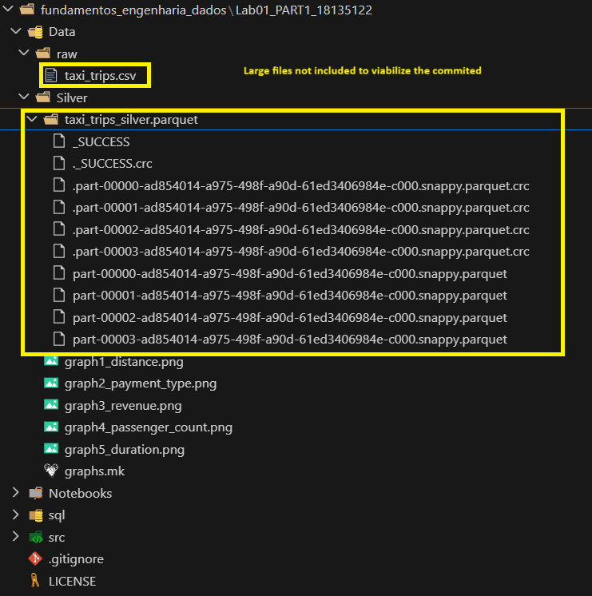

# -Lab01_PART1_18135122

LABORATÓRIO 01-A: Ingestão de Dados End-to-End (Local)

---

# 🚕 NYC Taxi Data Engineering Project

## 📌 Overview

This project implements a complete **Data Engineering pipeline** using the **Medallion Architecture (Bronze, Silver, Gold)**.

The pipeline processes large-scale taxi trip data (1M+ rows) and transforms it into a structured analytical model stored in PostgreSQL.

---

# 🏗️ Architecture

## 🔄 Data Flow

```
Data Source (PostgreSQL) → Python (PySpark) → Parquet → PostgreSQL
```

## 📊 Description

1. **Source**: Raw taxi trip data stored locally in PostgreSQL
2. **Bronze Layer**: Data extracted using Python and stored without transformation
3. **Silver Layer**: Data cleaning, analysis, and visualization using PySpark
4. **Gold Layer**: Star Schema modeling and loading back into PostgreSQL

---

## ⚙️ Technologies Used

* Python 3.9+
* PySpark
* PostgreSQL
* psycopg2
* Matplotlib
* VSCode
* Git & GitHub

---

## 📂 Project Structure

```
project/
│
├── Data/
│   ├── raw/        # Bronze layer (raw data in csv - git ignored to viabilize the commit)
│   └── Silver/     # Cleaned data + reports + graphs (parquet file git ignored to viabilize the commit)
│
├── sql/
│   ├── query_results/  # Business queries outputs (CSV)
│   ├── queries.sql     # Business queries
│   └── schema.sql      # Table creation scripts
│
├── src/
│   ├── bronze.py   # Extract data from PostgreSQL
│   ├── silver.py   # Data cleaning + analysis
│   └── gold.py     # Star schema + load to PostgreSQL
│
├── Notebooks/      # Optional exploration
├── requirements.txt
└── README.md
```
##### **Large files not included in the commit*

---

# 🥉 Bronze Layer

## 📥 Description

* Extracts raw data from PostgreSQL
* No transformations are applied

## 📌 Output

* CSV file stored in `Data/raw/`

---

# 🥈 Silver Layer

## 🧹 Data Processing

* Removed duplicate records
* Filtered invalid trips (distance ≤ 0, fare ≤ 0)
* Converted datetime fields
* Created trip duration column
* Removed outliers (extreme durations)

---

## 📊 Data Analysis

Generated reports including:

* Null value count per column
* Column data types
* Descriptive statistics:

  * Mean
  * Standard deviation
  * Min / Max

---

## 📈 Visualizations

The following graphs were generated:

* Trip distance distribution
* Revenue over time
* Passenger count distribution
* Payment type distribution
* Trip duration histogram

📁 Location:

```
Data/Silver/*.png
```

---

## 📌 Output

* Clean dataset → `Data/Silver/taxi_trips_silver.parquet`
* Graphs → `Data/Silver/*.png`
* Report → `Data/Silver/graphs.mk`

---

# 🥇 Gold Layer

## ⭐ Data Modeling

A **Star Schema** was implemented:

### 📅 Dimension Table: `dim_date`

| Column  | Description     |
| ------- | --------------- |
| date    | Trip date       |
| year    | Year            |
| month   | Month           |
| day     | Day             |
| weekday | Day of the week |

---

### 📊 Fact Table: `fact_trips`

| Column              | Description          |
| ------------------- | -------------------- |
| pickup_datetime     | Pickup timestamp     |
| dropoff_datetime    | Dropoff timestamp    |
| passenger_count     | Number of passengers |
| trip_distance       | Distance of the trip |
| fare_amount         | Base fare            |
| tip_amount          | Tip value            |
| total_amount        | Total cost           |
| payment_type        | Payment method       |
| pickup_location_id  | Pickup location ID   |
| dropoff_location_id | Dropoff location ID  |

---

## 🚀 Data Loading Strategy

Due to JDBC configuration constraints, data was loaded using:

* PySpark transformations
* Streaming data from Spark partitions
* PostgreSQL `COPY` command via psycopg2

This approach:

* Avoids memory overload
* Avoids intermediate files
* Ensures high performance

---

# 📊 Business Queries

The following analytical queries were implemented:

1. **Revenue Over Time**
2. **Average Trip Distance by Passenger Count**
3. **Revenue by Payment Type**
4. **Peak Demand by Weekday**
5. **Tip Behavior Analysis**

📁 Queries available in:

```
sql/queries.sql
```

📁 Results stored in:

```
sql/query_results/
```

---

# 📚 Data Dictionary

| Column                | Description                       |
| --------------------- | --------------------------------- |
| tpep_pickup_datetime  | Trip start timestamp              |
| tpep_dropoff_datetime | Trip end timestamp                |
| passenger_count       | Number of passengers              |
| trip_distance         | Distance traveled                 |
| fare_amount           | Base fare amount                  |
| tip_amount            | Tip value                         |
| total_amount          | Total trip cost                   |
| payment_type          | Payment method (cash, card, etc.) |
| PULocationID          | Pickup location ID                |
| DOLocationID          | Dropoff location ID               |

---

# ⚠️ Data Quality Issues

During the analysis, the following issues were identified:

* Missing values in some columns
* Invalid records (zero or negative trip distance and fare)
* Outliers in trip duration (extremely long trips)
* Skewed distributions in trip distance

## ✔ Fixes Applied

* Removed null and invalid records
* Filtered unrealistic trip durations
* Standardized datetime formats
* Cleaned dataset for analytical use

---

# ▶️ How to Run

## 1. Install dependencies

```
pip install -r requirements.txt
```

---

## 2. Start PostgreSQL

Ensure PostgreSQL is running locally:

```
host: localhost  
port: 5432  
user: postgres  
```

---

## 3. Run pipeline

Execute scripts in order:

```
python src/bronze.py
python src/silver.py
python src/gold.py
```

---

# ⚠️ Challenges Faced

* Handling large datasets (1M+ rows)
* Spark memory management (Java heap space)
* JDBC driver issues
* Efficient data loading into PostgreSQL

---

# 💡 Key Learnings

* Implementation of Medallion Architecture
* Distributed processing with PySpark
* Data modeling using Star Schema
* Efficient data ingestion strategies (COPY vs INSERT vs JDBC)
* Data visualization and reporting

---


# 👨‍💻 Author

Christian Andrade Mendes

---

# 📎 License

This project is for academic purposes.
